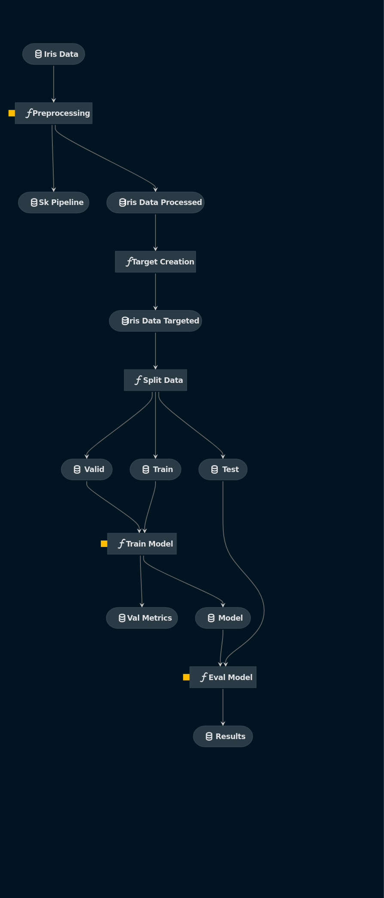

# kedro_iris

## Overview

This is your new Kedro project, which was generated using `Kedro 0.17.5`.

This is a toy project using iris data and a random forest classifier

## Pipeline



## How to install dependencies

Declare any dependencies in `src/requirements.txt` for `pip` installation and `src/environment.yml` for `conda` installation.

To install them, run:

```
kedro install
```

## How to run your Kedro pipeline

You can run your Kedro project with:

```
kedro run
```

## How to test your Kedro project

Have a look at the file `src/tests/test_run.py` for instructions on how to write your tests. You can run your tests as follows:

```
kedro test
```

To configure the coverage threshold, go to the `.coveragerc` file.
